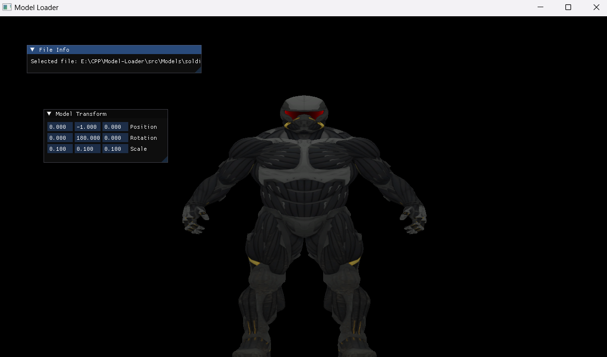
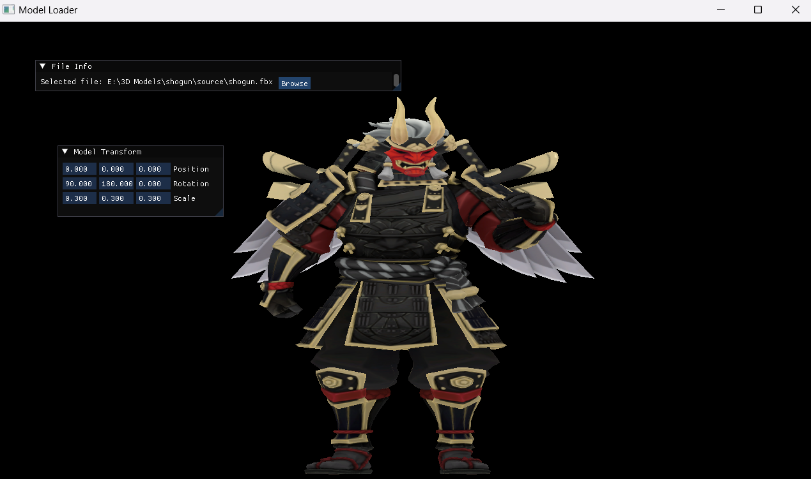

# Model Load

This program will load 3D models in OpenGL using the Assimp library


## How To Build

To Build this project just open cmd and run

```bash
  git clone https://github.com/alithegreat74/Model-Loader.git
  cd Model-Loader
  mkdir build
  cd build
  cmake ..
```
If you don't have cmake, I suggest you install that first.
BTW this program only runs on windows for now. the development for other opperating systems will be done (probably)

## Thirdparty Libraries

- Assimp (for loading the 3d models)
- glfw
- glad
- ImGui
- glm


## Screenshots



